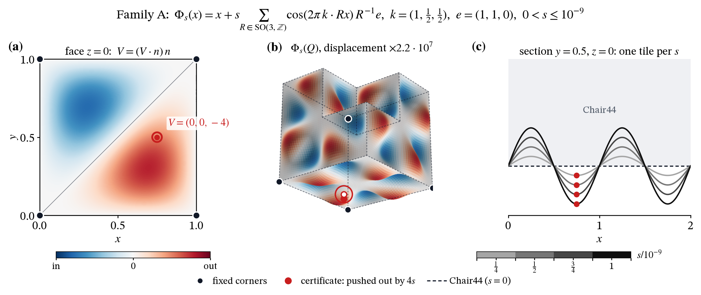
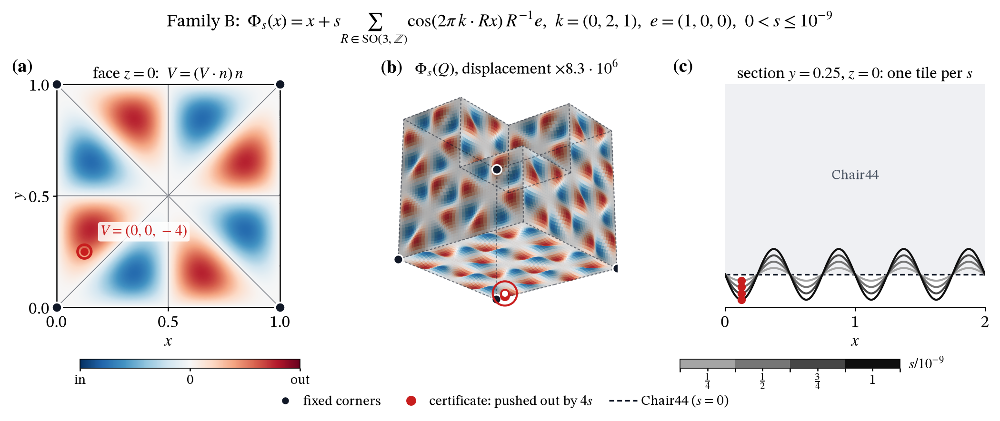
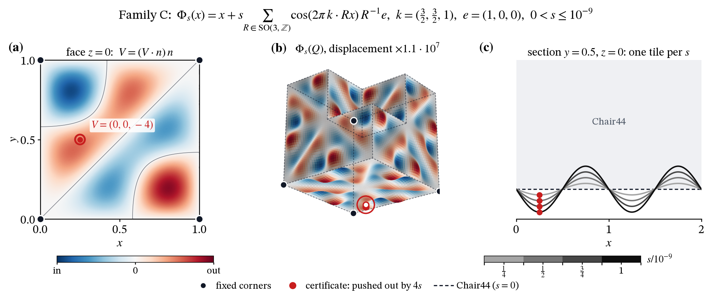

# Einstein Tile 3D Viz

Live demo: <https://sager611.github.io/einstein-tile-3d-viz/>  
Repository: <https://github.com/Sager611/einstein-tile-3d-viz>

A light-canvas React/Vite/TypeScript/Three.js/shadcn viewer for an independent reconstruction of the paper's exact **Chair44** geometry—not a generic voxel chair.

## Geometry

- 24 exposed panels and 192 panel features.
- Independent reconstruction audit: 4,272 triangles and 2,138 welded vertices.
- Proper eight-child substitution hierarchy: levels 0–6 contain 1/8/64/512/4,096/32,768/262,144 placements.
- Levels 0–3 use full 192-feature tiles. Levels 4–6 render all placements at their correct positions with a no-sampling 48-triangle carrier overview; selected tiles retain full 4,272-triangle geometry and unselected outlines are omitted.
- This is a finite patch. Exploded and magnified views are illustrative, not exact tilings. The cited work is a preprint/proposed result; this project makes no journal or peer-review claim.

## Controls

Adjust levels, spread, and layers; orbit, pan, and zoom; use presets; select/focus tiles; adjust one-tile height. The color legend hides/shows current-mode groups or **Show all**; its filters persist in shareable URL hashes. Optional UI affordances provide tooltips/Info and PNG export.

## Warp and Lean proof

The **Warp** drawer (wave button) deforms space by maps that commute with every motion used by Chair44 tilings (the 24 cube rotations with the body-centred cubic lattice, space group I432). Such a map turns every Chair44 tiling into a tiling by one new, congruent solid.

### Where the families come from

**Families A, B, C are not special.** They are three examples of one general Lean theorem:

> Bend space by any tiny smooth wave that respects Chair44's symmetries, and you get a new tile.
> Every such wave gives a whole infinite family of tiles (one per amplitude `s`).

| Theorem | Says | File |
|---|---|---|
| `Tiling.warp` | Any deformation commuting with Chair44's placement motions turns every Chair44 tiling into a tiling by one new tile. | [`Transfer.lean`](https://github.com/Sager611/einstein-tile-3d-viz/blob/main/lean/ChairWarp/Transfer.lean) |
| `WaveSpec.family_concrete` | Any valid wave `V(x) = Σ_R cos(2π k·Rx) R⁻¹e` (24 rotations `R`), at every amplitude `0 < s ≤ 10⁻⁹`: the tile `(id + sV)(Chair44)` tiles space, has no symmetry, differs from Chair44, and its warped Chair44 tilings have no period. | [`FamilyFinal.lean`](https://github.com/Sager611/einstein-tile-3d-viz/blob/main/lean/ChairWarp/FamilyFinal.lean) |
| `WaveSpec.family_noncongruent` | Different `s` give non-congruent tiles, so each wave gives an infinite family. | [`Congruence.lean`](https://github.com/Sager611/einstein-tile-3d-viz/blob/main/lean/ChairWarp/Congruence.lean) |

"Valid wave" = two conditions Lean checks by `decide`: small wave numbers with the right parity (`Good`), and one point the warp pushes out of Chair44 (`Cert`). Any `(k, e)` passing both is a new infinite family: two lines of Lean (see [`lean/README.md`](lean/README.md#adding-a-family)). A, B, C are simply the first three picked with visibly different surfaces:

| Family | `k` | `e` | Lean |
|---|---|---|---|
| A | (1, ½, ½) | (1,1,0) | [`familyA`](https://github.com/Sager611/einstein-tile-3d-viz/blob/main/lean/ChairWarp/FamilyFinal.lean#L172) |
| B | (0, 2, 1) | (1,0,0) | [`familyB`](https://github.com/Sager611/einstein-tile-3d-viz/blob/main/lean/ChairWarp/FamilyFinal.lean#L180) |
| C | (3/2, 3/2, 1) | (1,0,0) | [`familyC`](https://github.com/Sager611/einstein-tile-3d-viz/blob/main/lean/ChairWarp/FamilyFinal.lean#L188) |

Mixing several waves (`id + s₁V₁ + s₂V₂ + …`) gives many-parameter families; that generalization is not yet in Lean.

**Scope, honestly.**
- The proofs assume the Chair44 paper's Theorem 1.2 (a preprint).
- They cover amplitudes up to `10⁻⁹`: the true tiles differ from Chair44 by less than `10⁻⁷`. The viz and figures magnify that displacement about `10⁷` times.
- Non-periodicity is proved for the warped Chair44 tilings, not for every conceivable tiling by a warped tile.
- Not proved: tiles from *different* waves are non-congruent (numerically they clearly differ).
- These are all bends of one tile, so they multiply shapes, not ideas.

Paper-ready figures of the three families ([docs/figures](docs/figures/README.md), PDF/SVG/PNG):








Different arm sizes are impossible in both frameworks: see [research/asymmetric-arms](research/asymmetric-arms/README.md) (Lean: every equivariant warp fixes all cube corners).

The [Lean proof workflow](.github/workflows/lean.yml) rebuilds `lean/` and audits that every theorem uses only `propext`, `Classical.choice`, and `Quot.sound`.

## Development

```sh
npm ci
npm run dev
npm test
npm run build
```

Correctness coverage includes exact integer-grid contact checks through level 3 (**43,008 checked pairs** at level 3), plus occupancy and placement-count checks through level 6. The numerical extraction records source pin `d90313a717994936f254990f88d2624bbcce5bcd`.

`qa/mobile.html` is a 390×844 development fixture for manual visual QA. It is not a physical-touch test suite.

See [geometry and provenance](docs/geometry.md) and [third-party/licensing notes](THIRD_PARTY.md) for source references, reconstruction limits, and licensing details.
