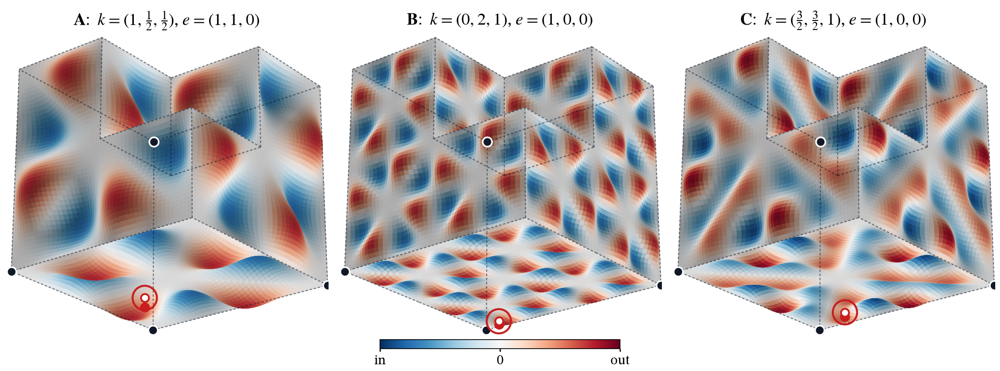

# Family figures

Vector (`.pdf`, `.svg`) and 300 dpi (`.png`) figures for three example Lean-proven warp families of Chair44
(A, B, C are instances of one general theorem, `WaveSpec.family_concrete`; any valid wave gives another),
generated from the exact formula by [`make_family_figures.py`](make_family_figures.py)
(`pip install -r requirements.txt && python3 make_family_figures.py`).

Each `family-X` figure:

- **(a)** Field on a face, which is purely normal there: `V = (V·n) n`. It vanishes at the corners, and the certificate point has `V = (0,0,−4)`.
- **(b)** The warped tile `Φ_s(Q)` (displacement magnified), shown with:
  - the dashed Chair44 ghost;
  - the fixed corners (dark);
  - the certificate point pushed out (red).
- **(c)** Section through the certificate point: one distinct tile per amplitude `s`.

| Theorems | File |
|---|---|
| `familyA/B/C` (tiles, rigid, non-periodic, differs from Chair44) | [`FamilyFinal.lean`](../../lean/ChairWarp/FamilyFinal.lean) |
| `familyA/B/C_noncongruent` (distinct `s` give non-congruent tiles) | [`Congruence.lean`](../../lean/ChairWarp/Congruence.lean) |

Checked numerically only (not in Lean): the fields are purely normal on faces, and the three families differ visually (face fields are uncorrelated).
